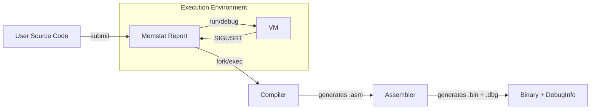

# Process-Managed Virtual Machine System (Cornerstone Lab 6)

This project implements a complete "Process-Managed System" where a custom Shell manages the lifecycle of programs executing on a Virtual Machine. It integrates a Compiler, Assembler, and VM into a cohesive pipeline, enabling advanced features like **Job Control**, **Source-Level Debugging**, and **Memory Leak Detection**.

## System Architecture

The system treats a user program as a first-class entity managed through a pipeline:



## System Requirements

This project was developed and tested on **macOS**.

### Tools Required

- **C Compiler**: `clang` (recommended) or `gcc`
- **Build System**: `make`
- **Scripting**: `python3` (for the Assembler)
- **Compiler Construction**:
  - `flex` (Lexical Analyzer)
  - `bison` (Parser Generator)

## Getting Started

Follow these **exact steps** to start the system:

**1. Open Terminal**
Open your terminal application.

**2. Navigate to Project Directory**
Use the `cd` command to go to the project folder:

```bash
cd /path/to/Cornerstone-Project-col7001-lab-6
```

**3. Build the Project**
Run the following command to clean previous builds and compile everything:

```bash
make clean && make
```

_Verification: This should generate `myshell`, `compiler`, and `vm` inside the `./bin/` folder._

**4. Start the Shell**
Launch the system shell:

```bash
./bin/myshell
```

---

## Usage Guide

### 1. The Shell

The shell is your command center. It supports standard Unix commands (`ls`, `pwd`, `exit`) along with special lifecycle commands.

| Command              | Description                                                      |
| :------------------- | :--------------------------------------------------------------- |
| `submit <file.lang>` | Compiles source code to binary (`.bin`) and debug info (`.dbg`). |
| `sys`                | Lists all registered programs.                                   |
| `run <id> [&]`       | Executes a program (optionally in background with `&`).          |
| `debug <id>`         | Launches the VM in interactive Debug Mode.                       |
| `memstat <pid>`      | Requests memory usage stats from a running VM process.           |
| `kill <pid>`         | Terminates a running process.                                    |

### 2. Workflow Examples

#### A. Source-Level Debugging

Create a file `debug_test.lang`:

```js
var x = 10;
var y = 20;
var z = x + y;
print(z);
```

**Session:**

```bash
myshell> submit debug_test.lang
[Shell] Compiling debug_test.lang -> debug_test.asm...
Program 1 registered.

myshell> debug 1
[DEBUG] Execution Finished.
vm-dbg> step
[Source Line 1] PC: 0, Opcode: 0x01
vm-dbg> step
[Source Line 2] PC: 8, Opcode: 0x01
vm-dbg> registers
PC: 16, SP: 0, RSP: -1
Top of Stack: 10
```

_Note: The debugger shows the original source line number!_

#### B. Background Execution & Memory Monitoring

Create `loop.lang`:

```js
var i = 0;
while (i < 1000000) {
  i = i + 1;
}
```

**Session:**

```bash
myshell> submit loop.lang
myshell> run 2 &
[Shell] Program 2 running in background (PID 1234)

myshell> memstat 1234
[Shell] Requesting memory stats for PID 1234...
[VM Memory Stats]
  Heap Used: 0 / 65536 words
  GC Runs: 0
  Freed Objects: 0
  Live Objects: 0

myshell> kill 1234
[Shell] Killed process 1234
```

### 4.4 Comprehensive Verification (Full Lifecycle)

Use the `comprehensive.lang` test file to verify all system features in one sequence.

```bash
# 1. Compile and Register
myshell> submit comprehensive.lang

# 2. Run in Background (Note the PID)
myshell> run 1 &
[Shell] Program 1 running in background (PID 12345)

# 3. Check Status
myshell> jobs

# 4. Interact with Memory Manager (Use PID from step 2)
myshell> memstat 12345   # View Heap Usage
myshell> gc 12345        # Force Garbage Collection
myshell> leaks 12345     # Check for Memory Leaks

# 5. Terminate
myshell> kill 12345
```

---

## Advanced Features

### Memory Leak Detection (`leaks`)

The VM includes a garbage collector test mode. You can check for leaks (allocated objects that are unreachable but not freed).

**Example (`mem_test.asm`):**

```asm
PUSH 10
ALLOC   ; Allocate object 1
POP     ; Drop pointer -> LEAK!
PUSH 20
ALLOC   ; Allocate object 2
STORE 0 ; Store pointer -> SAFE
HALT
```

**Verify:**

1. Assemble: `python3 src/vm/assembler.py mem_test.asm mem_test.bin`
2. Run Debugger: `./bin/vm mem_test.bin --debug`
3. Command:

```bash
vm-dbg> leaks
[Leaks Report]
  Leak detected: Object at Heap[0] (Size: 10)
```

### Compiler Print Support

The compiler has been enhanced to support `print()` statements, which emit the `PRINT` opcode.

```js
print(10 + 20); // Output: 30
```

---

## Project Structure

### File Types

- **`.lang`**: High-level source code files (written in our custom language).
- **`.asm`**: Assembly language files generated by the compiler (human-readable).
- **`.bin`**: Binary bytecode files executed by the VM (machine-readable).
- **`.dbg`**: Debug metadata files mapping bytecode addresses to source line numbers.

### Source Code

- **`src/shell/`**:
  - `shell.c`: The main entry point for the Process Manager. Handles command parsing, job control (`fork`, `exec`, `waitpid`), and IPC signals.

- **`src/compiler/`**:
  - `lexer.l`: Flex specification for tokenizing `.lang` files.
  - `parser.y`: Bison grammar for constructing the AST.
  - `codegen.c`: Traverses the AST to generate `.asm` output, including `.line` directives for debugging.
  - `ast.c` / `ast.h`: AST node definitions and management.

- **`src/vm/`**:
  - `assembler.py`: Python script that converts `.asm` to `.bin` and generates `.dbg` sidecar files.
  - `vm.c`: The Virtual Machine runtime. Includes the CPU loop, Garbage Collector (Mark-and-Sweep), and Interactive Debugger.
  - `jit.c`: Experimental JIT compiler for performance optimization.
  - `opcodes.h`: Shared opcode definitions.
