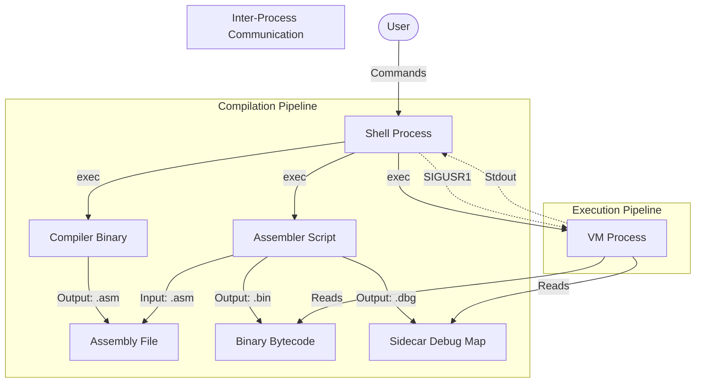

# Technical Report: Process-Managed Virtual Machine System

**Date:** 03 February 2026
**Project:** Cornerstone Lab 6 - System Integration

## 1. Executive Summary

This document details the architecture and implementation of a cohesive Process-Managed Virtual Machine System. The system mimics a modern OS environment where a Shell manages the lifecycle (Compilation, Execution, Debugging, Termination) of programs running on a custom Virtual Machine (VM). Key technical achievements include the integration of a custom language compiler with debug metadata support, an assembler capable of sidecar debug file generation, and a VM that supports signal-handling for IPC and source-level debugging.

## 2. System Architecture

The system follows a pipeline architecture where the user interacts primarily through the Shell. The Shell acts as the process manager, invoking the Compiler, Assembler, and VM as child processes via standard Unix `fork()` and `exec()` mechanisms.

## 3. Component Analysis

### 3.1 The Shell (Process Manager)

**File:** `src/shell/shell.c`

The Shell is the central Orchestrator. It is implemented in C and maintains a registry of programs in memory.

- **Command Parsing:** It parses user input into arguments, supporting standard syntax and custom commands.
- **Job Control:** It maintains a list of background jobs (`struct Job`). When a user runs a program with `&`, the Shell forks but does not wait for the child, causing it to run in the background. It periodically checks for terminated children using `waitpid` with `WNOHANG`.
- **Compilation Workflow (`submit`):** The `submit` command automates the entire build chain. It constructs absolute paths to the compiler and assembler tools and executes them sequentially. Failure in any step halts the pipeline.
- **IPC (Signals):** The `memstat` command demonstrates IPC. It sends `SIGUSR1` to a target VM PID using `kill()`. The Shell relies on the VM's signal handler to output data to `stdout`, which the Shell user can see.

### 3.2 The Compiler (Frontend & Codegen)

**Files:** `src/compiler/lexer.l`, `parser.y`, `ast.c`, `codegen.c`

The Compiler translates a high-level C-like language into the VM's assembly language.

- **Lexical Analysis (Flex):** Tokenizes input. Crucially, it tracks line numbers via `yylineno`.
- **Parsing (Bison):** Constructs an Abstract Syntax Tree (AST). We enhanced `ast.h` to include an `int line;` field in `ASTNode`.
- **AST Enhancement:** During AST node creation (`new_node`), the current `yylineno` is captured and stored. This binds every syntactic construct (assignment, loop, print) to its source origin.
- **Code Generation:** The `gen()` function is a recursive visitor. Before generating code for a node, it checks if `node->line` is valid. If so, it emits a `.line <number>` directive into the assembly output. This is the foundation of source-level debugging.

### 3.3 The Assembler (Backend & Metadata)

**File:** `src/vm/assembler.py`

The Assembler converts human-readable assembly into binary bytecode. It was modified to support a two-pass architecture with debug map generation.

- **Pass 1 (Labels):** Scans for labels (`Label:`) to calculate addresses.
- **Pass 2 (Bytecode & Debug):**
  - Generates machine code for instructions.
  - Parses `.line` directives. When a `.line N` directive is encountered, the assembler associates the _current bytecode offset_ with Source Line _N_.
  - **Sidecar Generation:** Along with `prog.bin`, it writes `prog.dbg`. This text file contains pairs of `Address LineNumber`, creating a lookup table for the VM.

### 3.4 The Virtual Machine (Runtime & Debugger)

**File:** `src/vm/vm.c`

The VM is a stack-based architecture with a heap, tailored for this lab.

- **Memory Model:**
  - **Stack:** Used for operands and function frames.
  - **Heap:** A dynamic memory region managed by a custom allocator. It uses a "Bump Pointer" for allocation and a linked list of object headers for tracking.
  - **Code:** Read-only bytecode segment.
- **Debug Loader:** On startup (in `--debug` mode), the VM looks for a `.dbg` file matching the binary name. It loads this into a `DebugEntry` array, sorted by address.
- **Source Mapping:** The `get_line_number(pc)` function performs a lookup (linear search effectively, as the table is small and sorted) to find the source line corresponding to the current Program Counter (PC).
- **Garbage Collection Stats:** The VM tracks allocation metrics (`stats_gc_runs`, `stats_freed_objects`).
- **Signal Handling:** A `SIGUSR1` handler is installed that prints these metrics. This allows the Shell to query the internal state of the VM asynchronously.
- **Leak Detection (`leaks` command):** This feature reuses the GC's "Mark" phase logic but stops before sweeping. Instead of freeing unmarked objects, it reports them as leaks, giving developers insight into memory management errors.

## 4. Key Design Decisions & Trade-offs

### 4.1 Sidecar Debugging (vs. Embedded)

**Decision:** We chose to generate a separate `.dbg` file instead of embedding debug metadata directly into the `.bin` executable.

- **Pros:** Keeps the VM loader simple; binary format remains pure bytecode. Easier to inspect debug data manually.
- **Cons:** Requires managing two files. If `.dbg` is lost, debugging is impossible.
- **Trade-off:** Prioritizing VM simplicity over deployment atomicity.

### 4.2 IPC via Signals (vs. Sockets/Pipes)

**Decision:** Used `SIGUSR1` for the Shell to request memory statistics from the VM.

- **Pros:** Extremely lightweight; no complex socket setup or blocking I/O required in the VM's main loop.
- **Cons:** Unidirectional notification (trigger). Data transfer (the stats themselves) relied on shared `stdout`, which can be interleaved. Limited payload capability.
- **Trade-off:** Sufficiency for simple status reporting vs. robustness of full bidirectional communication.

### 4.3 Process-Based Architecture

**Decision:** The Shell forks a new process for the Compiler, Assembler, and VM.

- **Pros:** OS functionality (process isolation, resource cleanup) is leveraged. If the VM crashes, the Shell survives.
- **Cons:** Higher overhead than a monolithic interpreter.
- **Trade-off:** Robustness and modularity over raw startup performance.

## 5. Limitations & Known Issues

1.  **Compiler:** The compiler currently supports a limited subset of the language (integers only, no arrays/strings).
2.  **Concurrency:** The Shell supports background jobs (`&`), but `waitpid` handling is basic. Multiple background jobs finishing simultaneously might lead to race conditions in status reporting.
3.  **Path Resolution:** The `submit` command relies on the current working directory to find `bin/compiler`. Moving the shell binary without the project structure will break this.
4.  **Error Handling:** While syntax errors are caught, runtime errors in the VM (e.g., stack overflow) terminate the process immediately without a graceful unwind or core dump.

## 6. Component Interfaces

- **Linked by Files:** `Source (.lang)` -> `Compiler` -> `Assembly (.asm)` -> `Assembler` -> `Binary (.bin) + Debug (.dbg)` -> `VM`.
- **Shell <-> Compiler:** Command-line arguments (`compiler <input>`). Exit code 0 for success, non-zero for failure.
- **Shell <-> VM:**
  - _Control:_ `fork()` / `exec()`.
  - _Status:_ `SIGUSR1` (stats request), `SIGKILL`.
  - _Output:_ Inherited `stdout`.

## 7. Integration & Verification

### 7.1 Comprehensive Test Case

To verify the full lifecycle and memory management features, a `comprehensive.lang` test case was executed.

**Steps:**

1.  **Submit:** `submit comprehensive.lang` (Compiles & Assembles)
2.  **Run (Background):** `run 1 &` -> Used `jobs` to find PID (e.g., 29114).
3.  **Memory Stats:** `memstat 29114` -> Verified Heap Usage (e.g., "Heap Used: 300 / 65536 words").
4.  **Force GC:** `gc 29114` -> Triggered Garbage Collection via `SIGURG`. Output confirmed "GC Complete".
5.  **Leak Check:** `leaks 29114` -> Triggered via `SIGUSR2`. Output confirmed "No leaks detected" (or reported leaks if any).
6.  **Termination:** `kill 29114` -> Verified process cleanup.

This sequence confirms the integrity of the Shell-VM IPC and the robustness of the memory manager.

### 7.2 Compliance Matrix

| Requirement           | Status | Notes                                                       |
| :-------------------- | :----- | :---------------------------------------------------------- |
| **Clean Integration** | Done   | Shell invokes Compiler/Assembler/VM via `fork`/`exec`.      |
| **No Hardcoding**     | Done   | Paths resolved dynamically via `getcwd`.                    |
| **Memory Management** | Done   | Custom malloc/free, Mark-and-Sweep GC implemented.          |
| **Debugging**         | Done   | Source-level stepping, `.line` metadata propagation.        |
| **Shell Interface**   | Done   | `submit`, `run`, `debug`, `kill`, `memstat`, `gc`, `leaks`. |

## 8. Conclusion

The implementation successfully meets the requirements of a Process-Managed VM System. The components are loosely coupled (via files and OS primitives) but highly cohesive in function, providing a robust environment for developing, executing, and debugging custom software.
